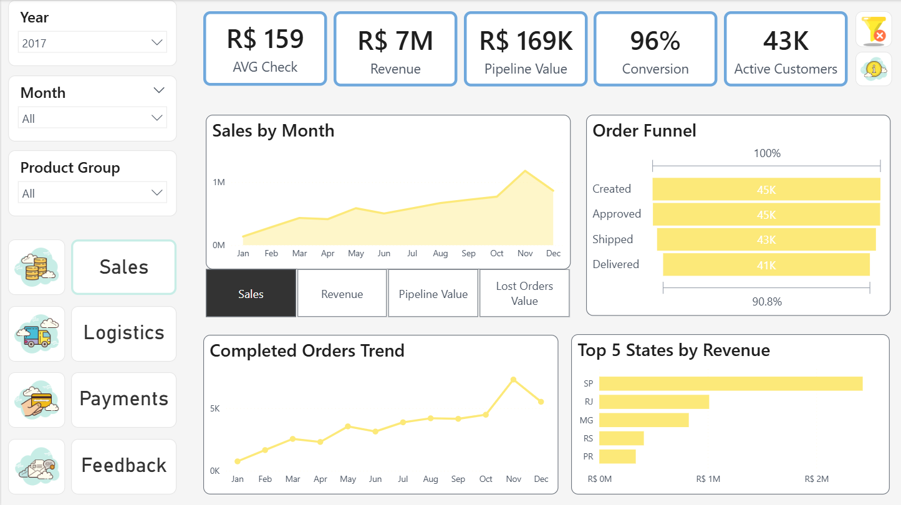
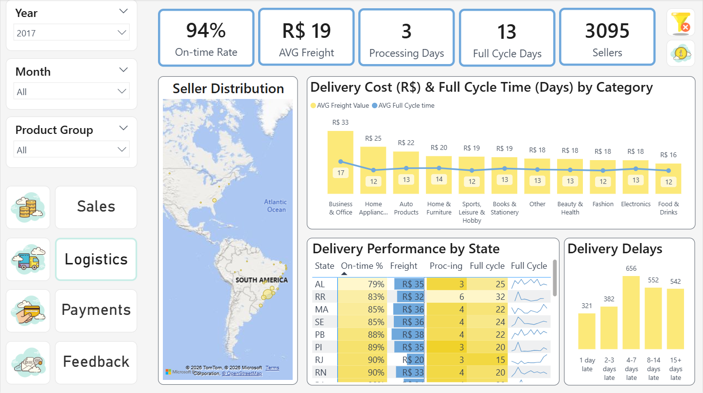
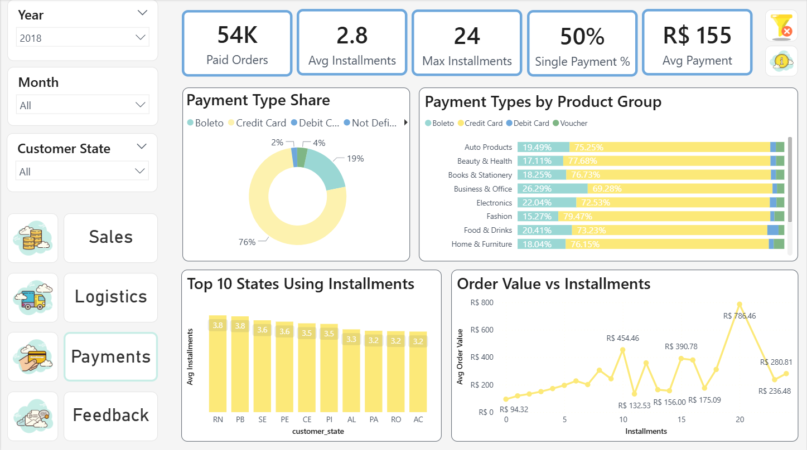
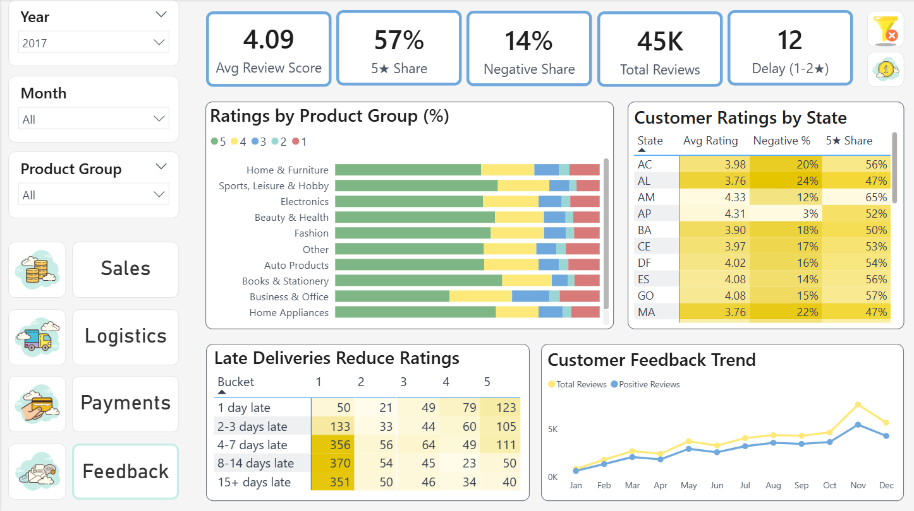
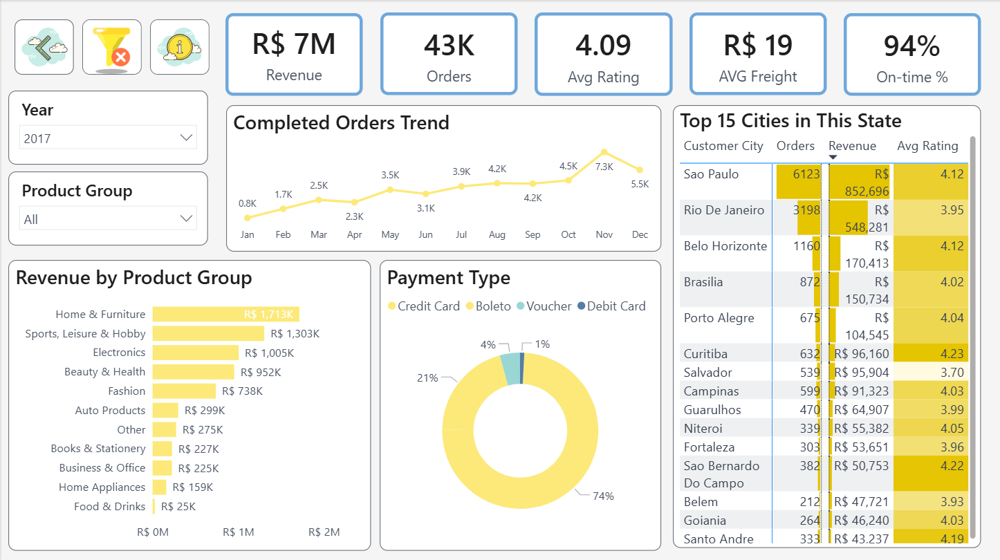
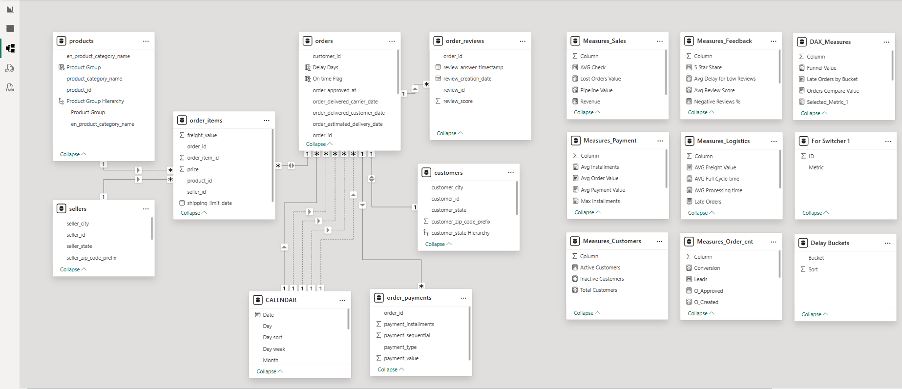
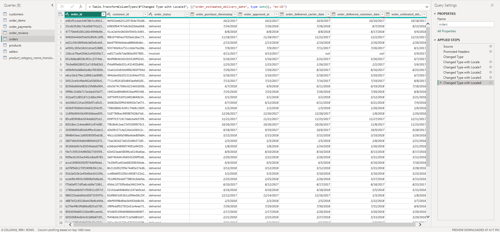

# Power BI E-Commerce Analytics Dashboard

Interactive multi-page Power BI dashboard for analyzing Brazilian e-commerce performance using the Olist dataset.

The dashboard combines sales, logistics, payments, and customer feedback analysis to identify business trends, operational bottlenecks, and relationships between customer experience and business performance.

---

# Dashboard Overview

The report was built using:
- Power BI
- Power Query
- DAX
- Data Modeling

The dashboard includes:
- multi-page navigation,
- drillthrough analysis,
- interactive slicers,
- KPI monitoring,
- custom DAX measures,
- tooltip interactions,
- and dynamic filtering.

---

# Dashboard Pages

## 1. Sales Analysis

Business overview page focused on:
- revenue trends,
- sales funnel performance,
- completed orders,
- regional sales distribution,
- product category performance,
- and customer activity.

### Main KPIs
- Average Check
- Revenue
- Pipeline Value
- Conversion Rate
- Active Customers



---

## 2. Logistics Analysis

Focused on operational efficiency and delivery performance.

### Main KPIs
- On-time Rate
- Average Freight Cost
- Processing Days
- Full Cycle Days
- Sellers Count

### Analysis Includes
- seller distribution,
- delivery delays,
- logistics performance by state,
- freight cost analysis,
- and full-cycle delivery time.



---

## 3. Payments Analysis

Focused on customer payment behavior and installment usage.

### Main KPIs
- Paid Orders
- Average Installments
- Maximum Installments
- Single Payment Share
- Average Payment Value

### Analysis Includes
- payment type distribution,
- installment behavior,
- average order value analysis,
- and payment trends across product groups.



---

## 4. Customer Feedback Analysis

Focused on customer satisfaction and review behavior.

### Main KPIs
- Average Review Score
- 5-Star Share
- Negative Review Share
- Total Reviews
- Delay Impact on Ratings

### Analysis Includes
- ratings by product category,
- customer feedback trends,
- regional review analysis,
- and delivery delay impact on ratings.



---

## 5. State Drillthrough Analysis

Detailed state-level drillthrough page for regional performance analysis.

### Main KPIs
- Revenue
- Orders
- Average Rating
- Average Freight
- On-time Rate

### Analysis Includes
- city-level performance,
- regional revenue analysis,
- payment distribution,
- and customer behavior by state.



---

# Business Insights

## Product Category Performance

The dashboard helps identify:
- top-performing product groups,
- low-performing categories,
- and revenue distribution across products.

### Business Value
Supports:
- product prioritization,
- category optimization,
- and sales strategy decisions.

---

## Delivery Impact on Customer Experience

One of the key insights of the project.

The dashboard reveals:
- delivery delay patterns,
- logistics issues by region,
- and the relationship between delays and review scores.

### Key Insight
Delivery delays negatively impact customer ratings.

### Business Value
Helps:
- identify problematic regions,
- improve logistics operations,
- and reduce negative customer feedback.

---

## Customer Payment Behavior

The dashboard analyzes:
- payment methods,
- installment usage,
- average payment value,
- and the relationship between order value and installments.

### Key Insight
High-value orders are more likely to be paid in installments.

### Business Value
Supports:
- payment strategy optimization,
- customer behavior analysis,
- and installment policy evaluation.

---

## Customer Satisfaction Analysis

The dashboard provides insights into:
- review scores,
- positive vs negative feedback,
- review trends over time,
- and ratings by category and region.

### Business Value
Helps:
- identify weak product groups,
- understand customer pain points,
- and improve customer experience.

---

## Regional Performance Analysis

Using drillthrough analysis, the dashboard enables:
- state-level revenue analysis,
- logistics performance comparison,
- regional rating analysis,
- and top city identification.

### Business Value
Supports:
- regional decision-making,
- operational optimization,
- and performance benchmarking across states.

---

# Core Dashboard Objective

The dashboard was designed not only to monitor KPIs, but also to identify relationships between:
- sales,
- logistics,
- payments,
- and customer satisfaction.

---

# Data Model

The dashboard uses a relational data model with:
- fact and dimension tables,
- calendar table,
- custom DAX measure tables,
- hierarchies,
- and optimized relationships.



---

# Power Query Transformations

Data preparation and transformation were performed in Power Query.

Main transformations included:
- data type corrections,
- calculated columns,
- date formatting,
- data cleaning,
- and relationship preparation.



---

# Dataset

Dataset source:
Olist Brazilian E-Commerce Dataset
> Note: Source CSV files are not included in this repository due to GitHub browser upload limitations.

Main tables used:
- olist_customers_dataset.csv
- olist_order_items_dataset.csv
- olist_order_payments_dataset.csv
- olist_order_reviews_dataset.csv
- olist_orders_dataset.csv
- olist_products_dataset.csv
- olist_sellers_dataset.csv
- product_category_name_translation.csv

---

# Features

- Multi-page dashboard
- Interactive slicers
- Drillthrough navigation
- Dynamic filtering
- KPI cards
- Custom DAX measures
- Power Query transformations
- Funnel analysis
- Geographic analysis
- Tooltip interactions
- Responsive page navigation

---

# Tools & Technologies

- Power BI
- DAX
- Power Query
- Data Modeling
- CSV Data Sources

---

# Project Structure

```text
powerbi-ecommerce-analytics-dashboard/
│
├── dashboard/
│   └── ecommerce_dashboard.pbix
│
├── data/
│   └── Dataset files are not included due to GitHub upload limitations.
│
├── images/
│   ├── dashboard_overview.png
│   ├── logistics_analysis.png
│   ├── payments_analysis.png
│   ├── customer_feedback_analysis.png
│   ├── state_drillthrough.png
│   ├── data_model.png
│   └── power_query_orders.png
│
└── README.md
```

---

# Key Project Insights

- Delivery delays negatively impact customer ratings.
- High-value orders are more likely to be paid in installments.
- Customer satisfaction differs across states and product categories.

---

# Author

Sabina Koniieva  
Junior Data Analyst | Power BI | SQL | Python | Tableau
